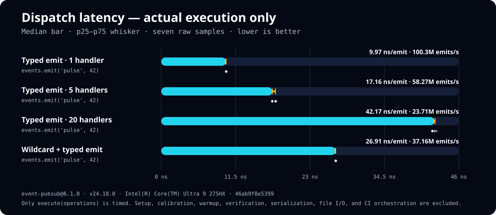

# event-pubsub

[](https://github.com/RIAEvangelist/event-pubsub/actions/workflows/ci.yml)
[](https://github.com/RIAEvangelist/event-pubsub/releases)
[](https://www.npmjs.com/package/event-pubsub)
[](./package.json)
[](./package.json)
[](https://www.npmjs.com/package/strong-type)
[](https://www.npmjs.com/package/vanilla-test)
[](./licence)

[](https://riaevangelist.github.io/event-pubsub/reports/node/test-results.json)
[](https://riaevangelist.github.io/event-pubsub/reports/chrome/test-results.json)

[](https://riaevangelist.github.io/event-pubsub/reports/node/)
[](https://riaevangelist.github.io/event-pubsub/reports/node/)
[](https://riaevangelist.github.io/event-pubsub/reports/node/)
[](https://riaevangelist.github.io/event-pubsub/reports/node/)

[](https://riaevangelist.github.io/event-pubsub/reports/chrome/)
[](https://riaevangelist.github.io/event-pubsub/reports/chrome/)
[](https://riaevangelist.github.io/event-pubsub/reports/chrome/)
[](https://riaevangelist.github.io/event-pubsub/reports/chrome/)

Small, synchronous, extensible publish/subscribe events for Node.js plus bundled and unbundled browsers.

**It works with bundlers and without a bundler.** Both paths execute the same native ESM source; direct browser use needs only a standard import map, not a build or transpilation step.

> **Release status:** `6.1.1` is the current npm and GitHub release.


```sh
npm install event-pubsub
```

```js
import EventPubSub from 'event-pubsub';

const events = new EventPubSub();

events.on('ready', (payload) => {
    console.log(payload);
});

events.emit('ready', {fast: true});
```

That bare import is also the bundler entry. In a native browser application with no bundler, keep the same import and add the complete [import map shown below](#browser-use-bundled-and-unbundled).

The same source is available directly to CommonJS on Node.js 22.12 or newer:

```js
const EventPubSub = require('event-pubsub');
```

## Measured dispatch speed

[](https://riaevangelist.github.io/event-pubsub/benchmarks-dispatch.html)

Bars show median nanoseconds per emit, whiskers show p25–p75, and dots show all seven samples. Every rate is derived from the same execution-only measurement; setup, warmup, validation, verification, serialization, file I/O, and CI orchestration are excluded. Lower latency is better. Open the [interactive charts](https://riaevangelist.github.io/event-pubsub/benchmarks.html) or [raw schema v2 evidence](https://riaevangelist.github.io/event-pubsub/data/benchmark.json).

## Why this module

- Five fluent methods: `on`, `once`, `off`, `emit`, and `reset`.
- Synchronous, registration-order dispatch with wildcard subscribers first.
- One-shot subscribers are removed before invocation, including reentrant emits.
- Subscriber arrays remain live during an emit: additions can run in that emit, and specifically removed handlers are skipped before their turn. Removing a whole bucket or resetting the registry detaches it from future lookup while an already-active array finishes.
- Safe event names, including `__proto__`, `constructor`, and `toString`.
- Isolated `list` snapshots that cannot mutate the live registry.
- One native ESM source for Node.js `import`/`require()`, bundled browser applications, and unbundled browser modules, without transpilation or a duplicate build.
- One explicit production validator: `strong-type` 2.0.0, resolved through the package dependency boundary with an explicit browser entry and import map.

## API

| Member | Signature | Behavior |
| --- | --- | --- |
| `on` | `on(type, handler, once = false)` | Register a persistent or explicitly one-shot handler. |
| `once` | `once(type, handler)` | Register a handler removed immediately before its first call. |
| `off` | `off(type = '*', handler = '*')` | Remove every matching handler or a whole event type. |
| `emit` | `emit(type, ...payload)` | Run wildcard handlers, then typed handlers, synchronously. |
| `reset` | `reset()` | Clear the complete registry. |
| `list` | `get list()` | Return an isolated null-prototype object snapshot of handler arrays. |

All public mutators return the current instance. Event types must be strings, and `on`/`once` validate their handler immediately. For 5.x compatibility, `off` returns early for a missing type before validating its optional handler. Synchronous handler throws propagate to the publisher; return values and promises are ignored, so applications must handle asynchronous rejections themselves.

### Wildcard events

`*` subscribers run before typed subscribers and receive the emitted type as their first argument.

```js
events.on('*', (type, ...payload) => {
    console.log(type, payload);
});

events.emit('invoice.paid', {id: 42});
```

The wildcard list entry is exposed at `Symbol.for('event-pubsub-all')`.

Only the exact public string `*` maps to the internal wildcard Symbol. The ordinary string `Symbol(event-pubsub-all)` remains an exact typed event name and never aliases wildcard removal.

### Browser use: bundled and unbundled

The 6.1.1 package imports `strong-type` by package name. Bundlers may use its explicit `browser` entry; native browsers do not read npm package metadata, so the import map selects `index.js` directly.

- With a standards-compatible bundler, both package names resolve normally. The release gate bundles and executes a packed conflicting-dependency consumer with Rollup 4.62.5 and node-resolve 16.0.3, configured only for JavaScript.
- Without a bundler, a modern browser runs the same files directly through native ESM. Put this import map before the first module script that starts the graph and serve the directory over HTTP(S):

```html
<script type="importmap">
{
  "imports": {
    "event-pubsub": "./node_modules/event-pubsub/index.js",
    "strong-type": "./node_modules/strong-type/index.js"
  }
}
</script>
<script type="module">
  import EventPubSub from 'event-pubsub';
</script>
```

That example is non-bundled browser code: the browser fetches both files from the mapped URLs and executes them directly. The paths are relative to the HTML document, so the static server must expose the shown `node_modules` files. Open the application through HTTP(S), not `file://`.

If the application uses a strict Content Security Policy, configure it to authorize the inline import-map and module scripts—for example, with an allowed nonce or hash.

If the application intentionally installs an incompatible `strong-type` at its root, npm keeps event-pubsub's exact 2.0.0 dependency nested. Scope the validator mapping to the event-pubsub referrer so the browser preserves that same dependency boundary:

```html
<script type="importmap">
{
  "imports": {
    "event-pubsub": "./node_modules/event-pubsub/index.js",
    "strong-type": "./node_modules/strong-type/index.js"
  },
  "scopes": {
    "./node_modules/event-pubsub/": {
      "strong-type": "./node_modules/event-pubsub/node_modules/strong-type/index.js"
    }
  }
}
</script>
```

Adjust the URLs to the package layout exposed by your static server. The release gate installs the packed tarball twice and executes both maps in real Chrome; the conflict fixture poisons the root validator so the scoped nested mapping cannot pass accidentally.

## Complete verification summary

The shared host-neutral registry contains **131 unique checks**. `vanilla-test` 2.1.1 executes the same inventory in Node and real Google Chrome.

| Suite | Cases | Focus |
| --- | ---: | --- |
| Unit | 16 | Exports, state, fluent identity, validation, and list shape |
| Functional | 26 | Registration, dispatch, wildcard, once, removal, reset, and chaining |
| Integration | 14 | Subclassing, routing, isolation, namespaces, lifecycle, and errors |
| Behavioral | 12 | Given/When/Then workflows, lifecycle boundaries, routing, failures, async effects, and live membership |
| Regression | 43 | Mutation, reentrancy, snapshots, safe names, throws, and registration-local once state |
| Interface | 20 | Playground parsing, safe display, bounded state, benchmark evidence, units, and chart scaling |
| **Total** | **131** | One registry used by direct tests and both coverage runtimes |

### Runtime and CI matrix

| Verification | Runtime | Hosts | Result requirement |
| --- | --- | --- | --- |
| Direct shared suite | Node 22.12.0 and Node 24 | Ubuntu, macOS, Windows | 131/131 on every matrix job |
| Node coverage | Node 24.18.0 | Ubuntu | 131/131 and every native V8 gate at 100% |
| Browser coverage | Google Chrome Stable | Ubuntu | 131/131 and every native V8 gate at 100% |
| Packed consumer | Node 24 | Ubuntu | Exact tarball contents plus ESM/CommonJS execution of nested `strong-type` 2.0.0 under a poisoned root conflict |
| Packed unbundled browser | Chrome Stable | Ubuntu and local release host | Normal and scoped-conflict import maps execute the tarball directly over HTTP |
| Packed bundled browser | Rollup 4.62.5 + Chrome Stable | Ubuntu and local release host | A bundle resolves nested `strong-type` 2.0.0 and runs representative behavior under a poisoned root conflict |
| Shared-source package smoke | Node 22.12.0 | Ubuntu | The same packed `index.js` through ESM `import` and direct CommonJS `require()` |
| Execution benchmark | Node 24.18.0 | Ubuntu | Eight validated scenarios with execution-only timing boundaries |
| GitHub Pages | Node 24 | Ubuntu | 22 pages, both runtime reports, badges, benchmark JSON, scripts, links, and licenses |

### Coverage gates

| Runtime | Executable ranges | Block ranges | Function ranges | Executable lines |
| --- | ---: | ---: | ---: | ---: |
| Node 24.18.0 | 100% | 100% | 100% | 100% |
| Chrome Stable | 100% | 100% | 100% | 100% |

These are native V8 executable/block/function range and executable-line totals for `index.js`, not parser-derived Istanbul statement or branch counts. Node and Chrome produce independent HTML, JSON, LCOV, and normalized test-result artifacts.

### Commands

| Command | Purpose |
| --- | --- |
| `npm test` | Stage event-pubsub with its nested exact validator and run all 131 checks in Node. |
| `npm run test:unit` | Run the 16 Unit cases. |
| `npm run test:functional` | Run the 26 Functional cases. |
| `npm run test:integration` | Run the 14 Integration cases. |
| `npm run test:behavioral` | Run the 12 Behavioral scenarios. |
| `npm run test:regression` | Run the 43 Regression cases. |
| `npm run test:interface` | Run the 20 Interface cases. |
| `npm run coverage` | Run all 131 checks independently in Node and real Chrome with 100% gates. |
| `npm run coverage:node` | Generate only the Node native V8 report. |
| `npm run coverage:chrome` | Generate only the real-Chrome native V8 report. |
| `npm run benchmark` | Record seven fixed-count latency samples for eight scenarios. |
| `npm run benchmark:smoke` | Validate the benchmark quickly without replacing published results. |
| `npm run test:package` | Pack, inspect, install, and exercise a clean consumer. |
| `npm run test:browser-consumer` | Pack and execute normal-map, scoped-conflict-map, and Rollup browser consumers in real Chrome. |
| `npm run site:check` | Validate all focused pages, exact test inventories, scripts, links, forms, and assets. |
| `npm run verify` | Run the complete local release gate. |

### Published evidence

- [Testing strategy and suite totals](https://riaevangelist.github.io/event-pubsub/testing.html)
- [Live execution of all 131 checks](https://riaevangelist.github.io/event-pubsub/live.html)
- [Node test-result JSON](https://riaevangelist.github.io/event-pubsub/reports/node/test-results.json)
- [Chrome test-result JSON](https://riaevangelist.github.io/event-pubsub/reports/chrome/test-results.json)
- [Node HTML coverage](https://riaevangelist.github.io/event-pubsub/reports/node/)
- [Chrome HTML coverage](https://riaevangelist.github.io/event-pubsub/reports/chrome/)
- [Chrome coverage screenshot](https://riaevangelist.github.io/event-pubsub/reports/chrome/vanilla-test-chrome.png)
- [Execution-latency charts](https://riaevangelist.github.io/event-pubsub/benchmarks.html)
- [Raw benchmark schema v2 JSON](https://riaevangelist.github.io/event-pubsub/data/benchmark.json)

## Complete test inventory

Every test name below is sourced from the shared registry. The focused Pages site presents the same inventory one suite per page.

<details>
<summary><strong>Unit — 16 cases</strong></summary>

1. default and named exports reference the same class
2. a fresh instance exposes an empty list snapshot
3. instances own independent event registries
4. on returns the current instance
5. once returns the current instance
6. off returns the current instance when the type is absent
7. emit returns the current instance when the type is absent
8. reset returns the current instance
9. on requires a string event type
10. on requires a function handler
11. on requires a boolean once flag
12. once delegates type validation to on
13. once delegates handler validation to on
14. off requires a string event type
15. off validates a handler when the event exists
16. emit requires a string event type

</details>

<details>
<summary><strong>Functional — 26 cases</strong></summary>

1. on exposes the registered handler in list
2. on preserves registration order in list
3. duplicate registrations remain visible as separate entries
4. emit runs a registered handler synchronously
5. emit runs handlers in registration order
6. emit forwards every payload argument by identity
7. handlers run without an emitter-bound this value
8. once runs a handler exactly once
9. on with an explicit false once flag remains persistent
10. on with an explicit true once flag matches once
11. wildcard handlers receive the emitted type before payloads
12. wildcard handlers run before typed handlers
13. multiple wildcard handlers retain registration order
14. once supports wildcard subscriptions
15. wildcard handlers are exposed under the stable symbol
16. off removes a matching handler
17. off removes every duplicate registration of a handler
18. off leaves nonmatching handlers registered
19. off with a wildcard handler removes an event type
20. off defaults the handler argument to wildcard removal
21. off defaults the event type to wildcard subscriptions only
22. off removes one wildcard handler without touching typed handlers
23. reset removes typed and wildcard registrations
24. emitting an unknown type does not run other typed handlers
25. all public mutators support fluent chaining
26. the same function can be once and persistent independently

</details>

<details>
<summary><strong>Integration — 14 cases</strong></summary>

1. a subclass can publish state changes
2. multiple instances isolate same-named topics
3. namespaced topic strings remain exact
4. a wildcard audit stream observes several domains
5. a one-shot readiness gate coexists with persistent progress
6. a request-style payload preserves callbacks by identity
7. a handler can publish a second event synchronously
8. a wildcard handler can route selected events
9. reset provides a clean lifecycle boundary
10. empty and whitespace topic names remain distinct
11. unicode topic names and payloads pass through unchanged
12. async handlers are invoked without delaying synchronous peers
13. synchronous handler exceptions propagate to the publisher
14. list supports operational introspection without exposing records

</details>

<details>
<summary><strong>Behavioral — 12 scenarios</strong></summary>

1. given an audited order retry with one-time reservation and persistent projection, when the same order is published twice, then the audit leads both deliveries while reservation happens once
2. given an order handler that publishes the next workflow stage, when an order is created, then the nested fulfillment stage completes before outer delivery continues
3. given a one-time readiness gate that reenters its own topic, when the outer readiness signal arrives, then the gate is consumed before the nested signal
4. given a mounted subscriber that observes application updates, when the subscriber unmounts, then later updates no longer reach it
5. given listeners from an authenticated session, when logout resets the event hub and a new session starts, then only the new session observes later activity
6. given a bridge that forwards only public topics to another hub, when private and public messages are published, then only public messages cross the boundary
7. given a request carrying a reply callback, when a subscriber handles the request, then the caller receives the reply before publish returns
8. given a wildcard normalizer and a typed consumer sharing a payload, when the payload is published, then the consumer and caller observe the normalized object
9. given a one-time preflight followed by a failing persistent subscriber, when delivery is retried after the failure, then preflight stays consumed and the exact failure keeps reaching the publisher
10. given an asynchronous side effect beside a synchronous projection, when the event is published, then publish returns after starting both without awaiting the side effect
11. given subscriber membership that changes during a notification, when the current delivery adds one subscriber and removes another, then the added subscriber joins immediately and the removed one is skipped
12. given two tenant hubs with the same topic names, when each tenant publishes an update, then each update stays within its originating tenant

</details>

<details>
<summary><strong>Regression — 43 cases</strong></summary>

1. `__proto__` is a safe event name
2. `constructor` is a safe event name
3. `toString` is a safe event name
4. `hasOwnProperty` is a safe event name
5. numeric-looking event names remain strings
6. the wildcard symbol description remains an exact typed event
7. off compares the remove-all handler sentinel strictly
8. emitting the literal wildcard type invokes wildcard handlers once
9. handlers added during typed dispatch run in that emit
10. typed handlers added by a wildcard run in that emit
11. wildcard handlers added during wildcard dispatch run in that emit
12. handlers removed during dispatch do not run later in that dispatch
13. a wildcard can remove a typed handler before the typed phase
14. reset during typed dispatch leaves the active array running
15. reset from a wildcard finishes that array but prevents typed dispatch
16. once is removed before a reentrant emit
17. persistent reentrant emits preserve nested registration order
18. wildcard once is removed before a reentrant emit
19. a throwing once handler remains removed
20. a throwing once handler is absent from the next list snapshot
21. a throwing persistent handler remains registered
22. a thrown wildcard handler stops typed dispatch
23. off with a nonmatching function preserves the type
24. off ignores an invalid handler when the type is absent
25. mutating a list array does not change the registry
26. deleting a list property does not change the registry
27. mutating a wildcard list snapshot does not change the registry
28. frozen handler functions can be registered
29. nonextensible handler functions can be registered
30. duplicate once registrations each run once
31. the same handler can be wildcard-once and typed-persistent
32. registration does not write the old once symbol onto handlers
33. the same handler can be once and persistent in one bucket
34. the same handler has independent state across instances
35. typed once removal does not skip the next registration
36. wildcard once removal does not skip the next registration
37. a sole once handler can add a handler to its live bucket
38. off all during dispatch leaves the active array running
39. stale once cleanup cannot delete a fresh same-name bucket
40. an earlier once remains consumed when a later handler throws
41. persistent self-removal preserves shifted-array iteration
42. wildcard-only emits remain chainable
43. reset instances accept new registrations immediately

</details>

<details>
<summary><strong>Interface — 20 cases</strong></summary>

1. the playground parses no-argument mode
2. the playground preserves one exact text argument
3. the playground parses an empty JSON argument array
4. the playground spreads several JSON arguments
5. invalid playground JSON is an explicit syntax error
6. a non-array JSON argument source is rejected
7. typed playground subscriptions preserve whitespace
8. wildcard playground subscriptions resolve to star
9. typed star subscriptions require wildcard mode
10. event-type display quotes invisible characters
11. safe value formatting exposes undefined
12. safe value formatting marks circular references
13. safe value formatting bounds long output
14. bounded timeline retention keeps chronological tail entries
15. benchmark evidence accepts all eight unique scenarios
16. benchmark evidence rejects the wrong schema version
17. benchmark evidence rejects duplicate or internally inconsistent scenarios
18. benchmark dispatch selection returns four scenarios
19. benchmark durations choose readable nanosecond and microsecond units
20. benchmark chart values clamp and expose equivalent throughput

</details>

## Benchmark interpretation

The benchmark reports median **execution latency**—nanoseconds per named operation—with p25, p75, min, max, and every raw sample. Fixed-count loops use exactly two `process.hrtime.bigint()` readings around the execution boundary. Dispatch scenarios use distinct minimal observable subscribers, then verify their accumulated effects after timing so empty callbacks cannot become an optimizer-only lower bound. Setup, validation, calibration, warmup, post-run checks, summary work, JSON serialization, file I/O, Node startup, and CI orchestration are excluded. The charts never present total benchmark or workflow duration as module execution time.

## Documentation

- [Overview](https://riaevangelist.github.io/event-pubsub/)
- [Guide](https://riaevangelist.github.io/event-pubsub/guide.html)
- [API](https://riaevangelist.github.io/event-pubsub/api.html)
- [Examples](https://riaevangelist.github.io/event-pubsub/examples.html)
- [Event console playground](https://riaevangelist.github.io/event-pubsub/playground.html)
- [Mutation playground scenarios](https://riaevangelist.github.io/event-pubsub/playground-scenarios.html)
- [All 131 tests](https://riaevangelist.github.io/event-pubsub/testing.html)
- [Node and Chrome coverage](https://riaevangelist.github.io/event-pubsub/coverage.html)
- [Benchmark overview](https://riaevangelist.github.io/event-pubsub/benchmarks.html)
- [Dispatch latency chart](https://riaevangelist.github.io/event-pubsub/benchmarks-dispatch.html)
- [Lifecycle latency charts](https://riaevangelist.github.io/event-pubsub/benchmarks-lifecycle.html)
- [Benchmark methodology](https://riaevangelist.github.io/event-pubsub/benchmarks-methodology.html)
- [5.x → 6.x migration](./MIGRATION.md)
- [Security policy](./SECURITY.md)
- [Changelog](./CHANGELOG.md)

## Runtime support

- Node.js 22.12.0 or newer for production, development, and direct CommonJS `require()` of the native ESM source.
- Bundled browser applications; the bundler resolves `event-pubsub` and `strong-type` from package metadata normally.
- Unbundled modern browsers with native modules, private class fields, `Symbol`, and import maps; no build step is required. Map both package names, with a scoped validator mapping when npm nests it.

## License

MIT. See [licence](./licence).
